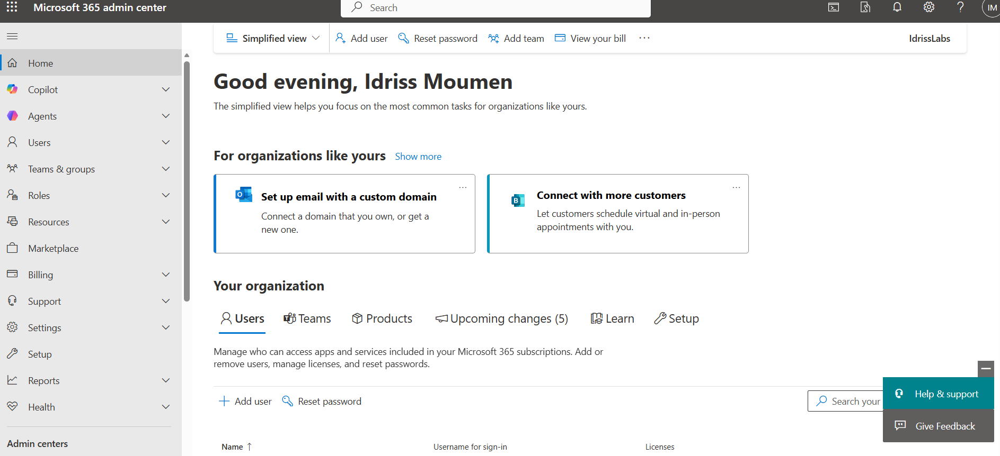
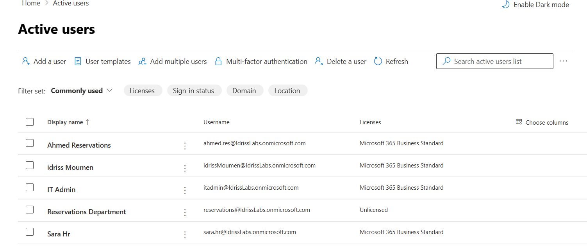
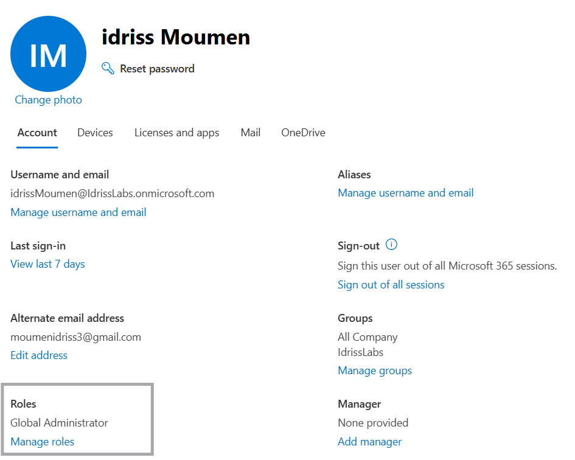

# 01 - Tenant Setup

## Objective
To create and configure a Microsoft 365 cloud tenant and gain access to the Microsoft 365 Admin Center.

---

## Steps Performed

1. Signed up for a Microsoft 365 Business Standard trial.
2. Created a new tenant with the domain:
   `idrisslabs.onmicrosoft.com`
3. Completed the initial setup wizard.
4. Logged into the Microsoft 365 Admin Center.
5. Verified Global Administrator access.

---

## Observations

- The tenant was provisioned automatically by Microsoft.
- Exchange Online services were enabled by default with the assigned license.
- The initial account created during setup was assigned the Global Administrator role.
- The Microsoft 365 Admin Center provides centralized access to:
  - Users
  - Roles
  - Licenses
  - Exchange
  - Security settings

---

## Architecture Notes

In this lab, a **cloud-only identity model** is used:

- Entra ID acts as the identity provider.
- No on-prem Active Directory server is connected.
- Authentication and service access are fully cloud-managed.

---

## Screenshots

### Admin Center Homepage

### Active Users Overview

### Global Administrator Role Confirmation

