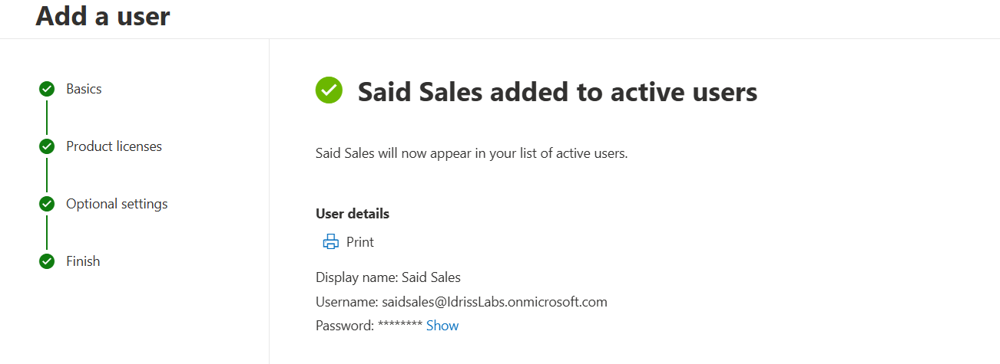
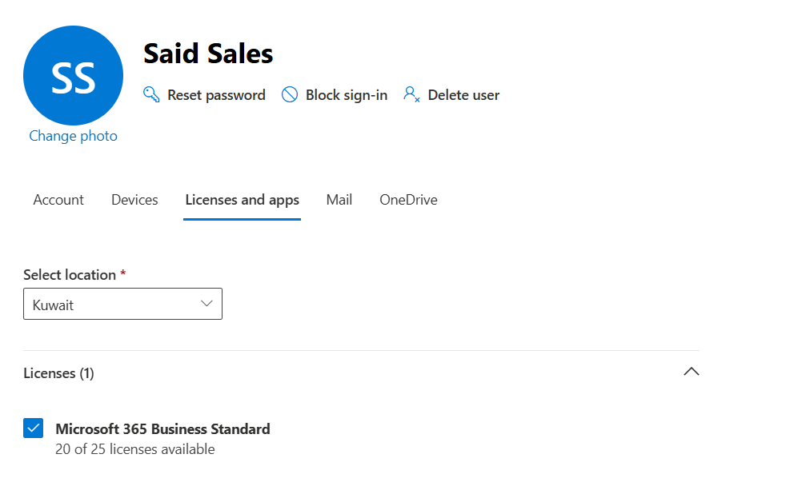
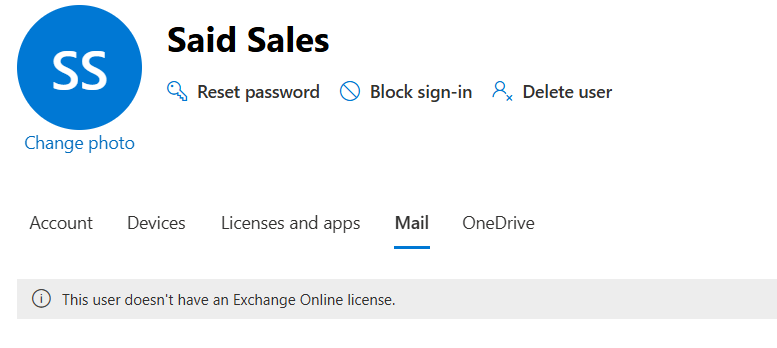
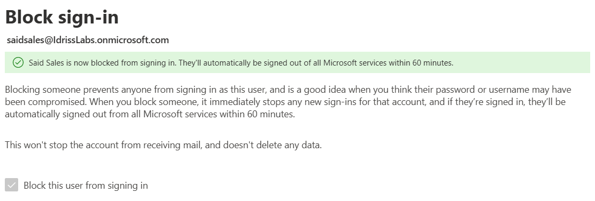

# User and License Management – Microsoft 365

## Overview

This lab demonstrates practical user lifecycle management in a Microsoft 365 environment using Entra ID (Azure AD) and the Microsoft 365 Admin Center.

The objective was to simulate real-world IT Support and Helpdesk tasks including user creation, license assignment, mailbox provisioning validation, and access control management.

---

## Environment

- Microsoft 365 Business (Trial Tenant)
- Entra ID (Azure AD)
- Exchange Online
- Microsoft 365 Admin Center

Tenant Domain:
`idrisslabs.onmicrosoft.com`

---

## Tasks Performed

### 1. User Provisioning

- Created new users in Entra ID
- Configured user profile information
- Assigned roles and validated sign-in settings

### 2. License Assignment

- Assigned Microsoft 365 Business license
- Verified service provisioning (Exchange Online mailbox creation)
- Observed license-based service activation behavior

### 3. License Removal & Service Impact

- Removed Microsoft 365 license
- Validated mailbox access removal
- Confirmed service dependency on active license

### 4. Account Access Management

- Blocked and unblocked user sign-in
- Validated authentication behavior after restriction
- Understood difference between blocking sign-in vs removing license

---

## Key Concepts Demonstrated

- Cloud identity management using Entra ID
- License-based service provisioning model
- Microsoft 365 user lifecycle management
- Exchange Online mailbox dependency on licensing
- Access control enforcement without deleting user objects

---

## Practical Relevance

These tasks simulate common Level 1 / Level 1.5 IT Support responsibilities including:

- User onboarding
- License troubleshooting
- Mailbox provisioning issues
- Access restriction handling
- Identity-based service management

---

## Screenshots

### 1️⃣ User Provisioning – Entra ID

A new cloud user was successfully created in Entra ID and added to Active Users.

---

### 2️⃣ License Assignment – Microsoft 365 Business Standard

Microsoft 365 Business Standard license assigned to the user, triggering service provisioning (Exchange Online, OneDrive, etc.).

---

### 3️⃣ License Removal – Exchange Online Dependency

After removing the Exchange Online license, mailbox access was disabled, demonstrating license-based service dependency.

---

### 4️⃣ Access Control – Block Sign-In

User sign-in was blocked without deleting the account, simulating a secure offboarding scenario.
