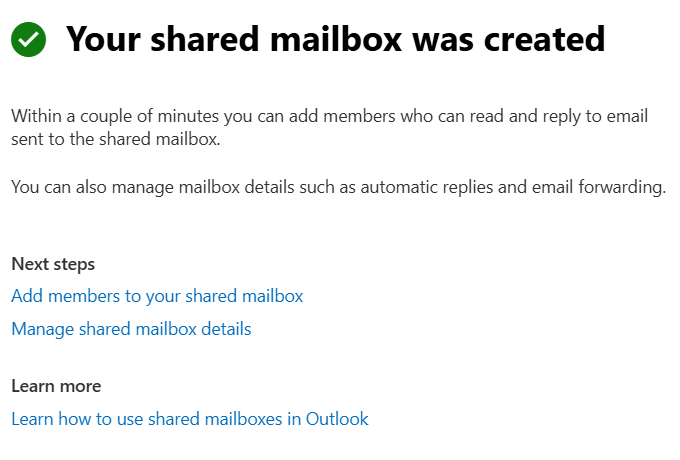
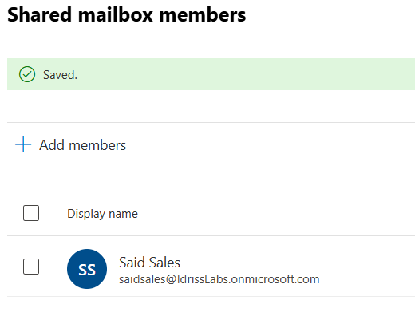
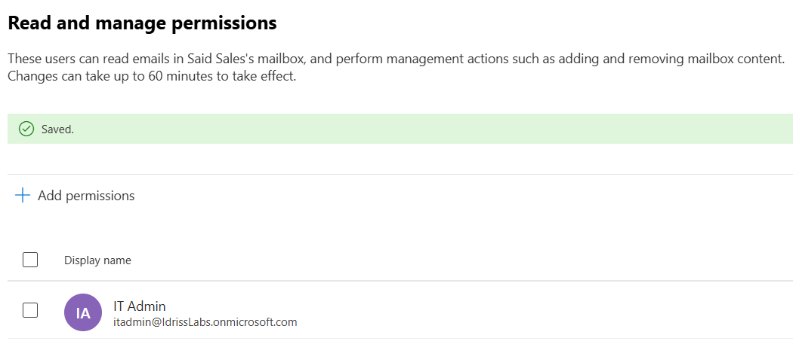
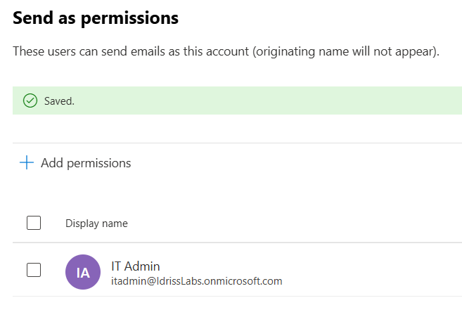

# Shared Mailbox Configuration & Delegation

## Overview

This lab demonstrates shared mailbox creation and delegated access management in Microsoft 365.

The objective was to simulate a real-world department mailbox scenario (e.g., reservations@company.com) where multiple users require access without sharing credentials.

---

## Environment

- Microsoft 365 Business Standard
- Entra ID (Azure AD)
- Exchange Online
- Microsoft 365 Admin Center

---

## Objectives

- Create shared mailbox
- Add members
- Configure Full Access permissions
- Configure Send As permissions
- Validate delegated access model

---

## Screenshots

### 1️⃣ Shared Mailbox Created

Shared mailbox successfully created in Exchange Online to simulate a departmental mailbox.

---

### 2️⃣ Members Added

User added as member of the shared mailbox, enabling access without credential sharing.

---

### 3️⃣ Full Access Permission

Full Access permission granted to allow reading and managing mailbox content.

---

### 4️⃣ Send As Permission

Send As permission configured to allow sending emails as the shared mailbox identity.
