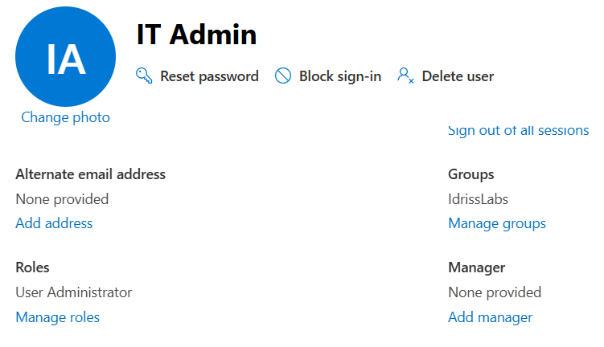
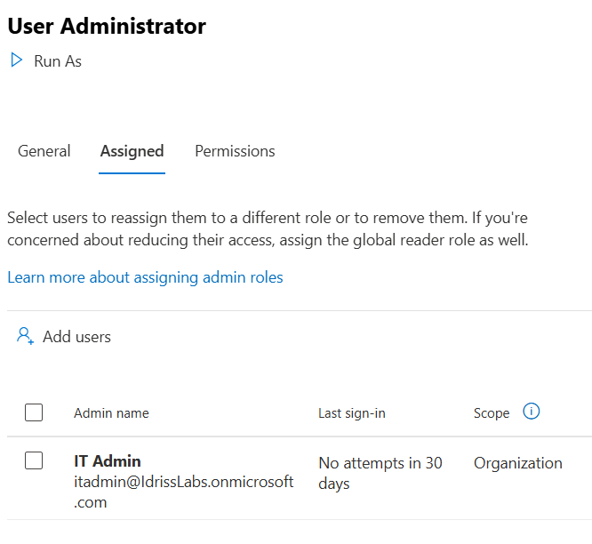

# Role-Based Access Control (RBAC) – Microsoft 365

## Overview

This lab demonstrates role-based access control (RBAC) in Microsoft 365 using Entra ID.

The objective was to simulate delegated administration without granting Global Administrator privileges, following the principle of least privilege.

---

## Environment

- Microsoft 365 Business Standard
- Entra ID (Azure AD)
- Microsoft 365 Admin Center

---

## Objectives

- Review available admin roles
- Assign User Administrator role to a user
- Validate role assignment
- Demonstrate delegated administration model
- Reinforce least privilege security practice

---

## Implementation Steps

### 1️⃣ Role Assignment

The **User Administrator** role was assigned to the IT Admin account.

This role allows:

- Creating and managing users
- Resetting passwords
- Managing group memberships
- Assigning licenses

Global Administrator privileges were intentionally avoided to follow least privilege principles.

---

### 2️⃣ Security Principle – Least Privilege

Instead of granting Global Administrator access, a scoped administrative role was delegated.

This ensures:

- Reduced attack surface
- Controlled administrative capabilities
- Separation of duties
- Compliance with enterprise security standards

## Screenshots

### 1️⃣ User Administrator Role Assigned

User Administrator role successfully assigned to delegated IT account.

### 2️⃣ Role Membership Confirmation

Verification from Entra ID role directory confirming IT Admin is assigned the User Administrator role at the organization scope.
