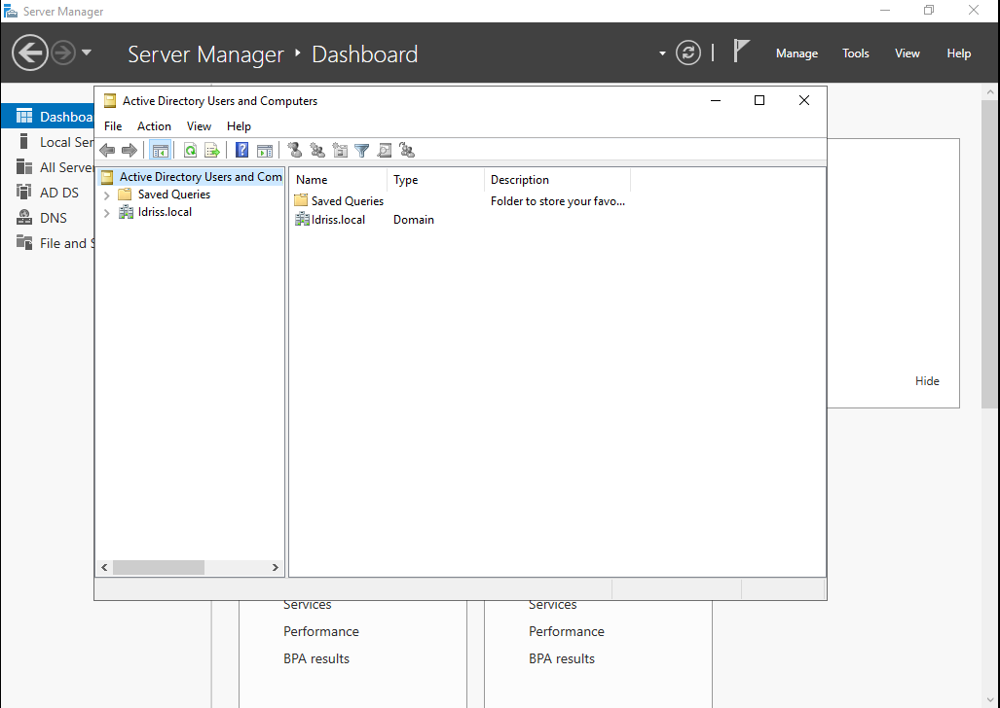
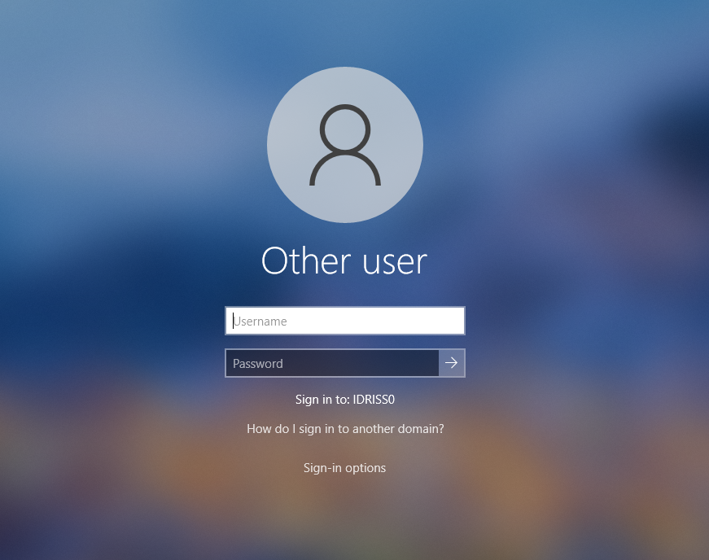

# Active Directory Domain Setup (Windows Server 2019)

## Environment
- Platform: VMware Workstation
- OS: Windows Server 2019
- Role: Domain Controller

## Objective
Set up a Windows Server 2019 domain controller and configure Active Directory Domain Services for centralized user and computer management.

## Actions Performed
- Installed Windows Server 2019 on a virtual machine
- Configured network settings and server hostname
- Added the Active Directory Domain Services (AD DS) role
- Promoted the server to a Domain Controller
- Created a new domain
- Verified AD services and domain functionality

## Tools Used
- VMware Workstation
- Windows Server 2019
- Active Directory Domain Services

## Screenshot

## Result
Successfully deployed a functional Active Directory domain, enabling centralized authentication and user management for a Windows environment.

🔧 Domain Join – Windows 10 Client

Objective
Join a Windows 10 workstation to an Active Directory domain and authenticate using domain credentials.

Actions Performed

Configured Windows 10 client DNS to point to the Domain Controller

Disabled IPv6 to avoid DNS resolution issues

Verified network connectivity using ping

Verified DNS resolution using nslookup

Joined Windows 10 workstation to the idriss.local domain

Logged in successfully using Active Directory credentials (UPN format)

Troubleshooting

Client could ping the Domain Controller but domain join initially failed

Root cause: DNS resolution / SRV record registration delay

Resolution:

Ensured client DNS pointed to Domain Controller IP

Restarted DNS and Netlogon services on the server

Verified domain resolution using nslookup

## Screenshots

### Windows 10 joined to domain

### Domain authentication screen

### DNS resolution verification

Result

Windows 10 workstation successfully joined to the Active Directory domain

User authenticated using domain credentials (Administrator@idriss.local)

