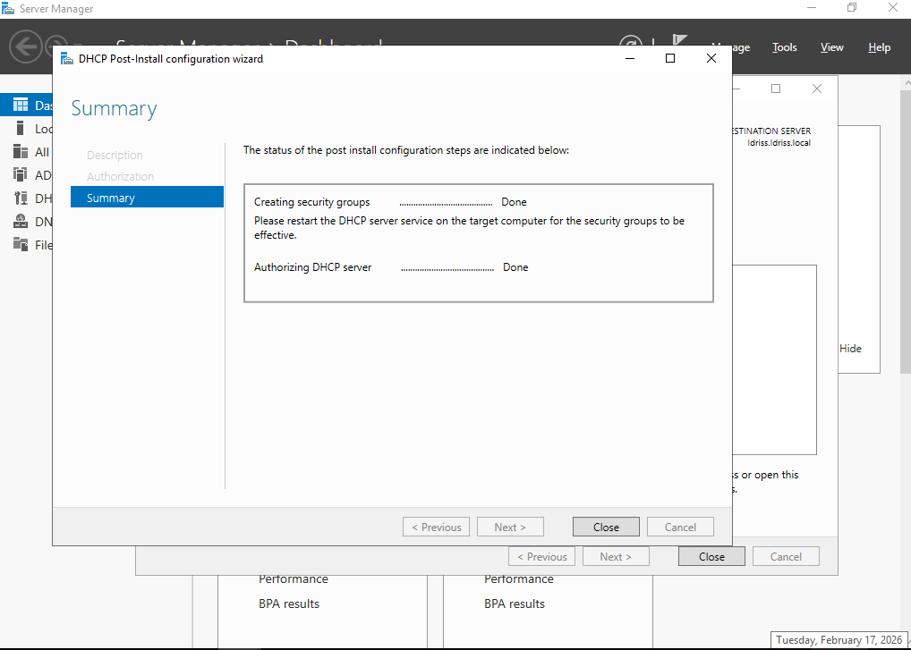
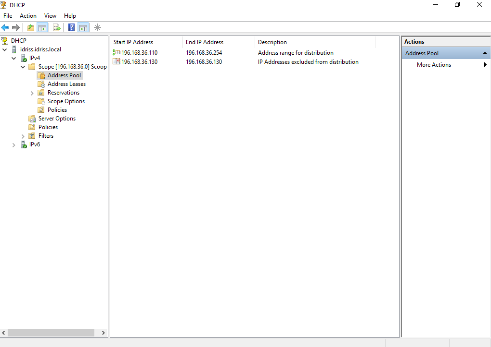
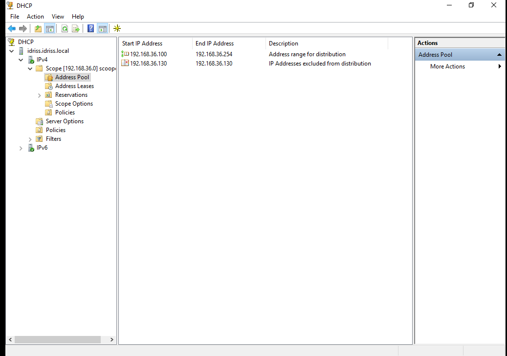
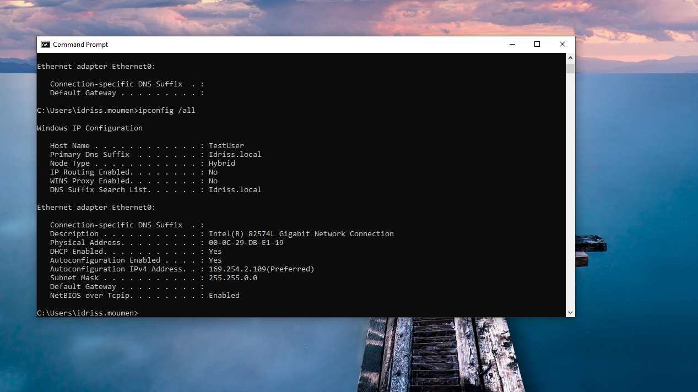
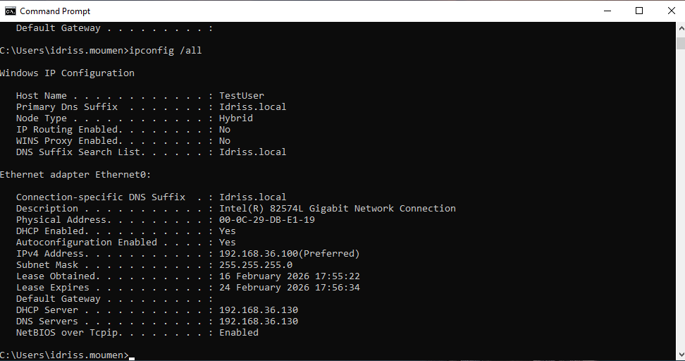
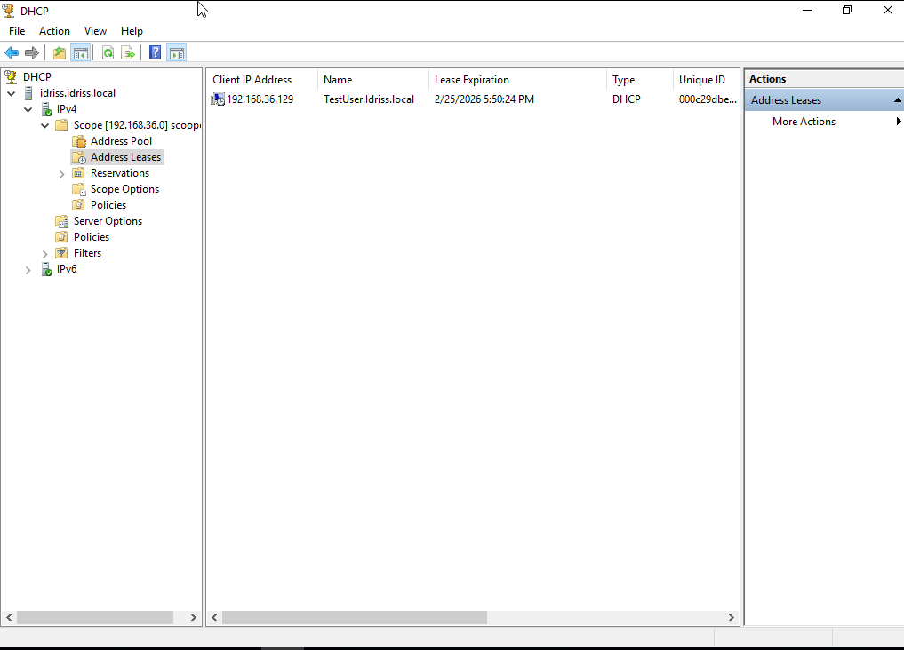
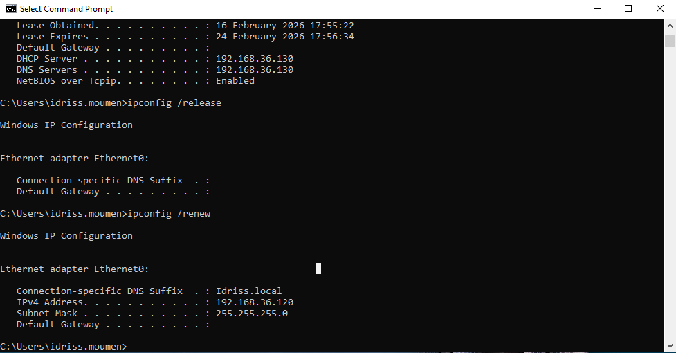
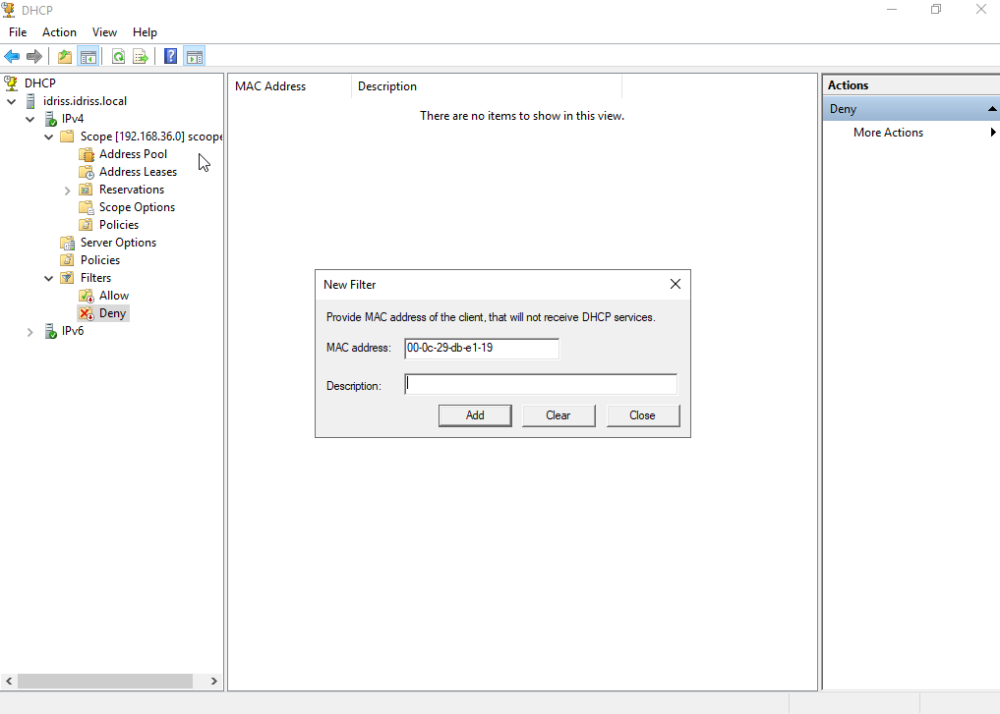

# 05 – DHCP Server Implementation and Troubleshooting

## 📌 Lab Overview

This lab demonstrates the installation, configuration, and troubleshooting of the DHCP role on Windows Server in a VMware isolated lab environment.

The objectives of this lab were:

- Deploy and authorize DHCP in Active Directory
- Configure an IPv4 scope
- Troubleshoot DHCP failures
- Verify lease assignment
- Configure DHCP reservation
- Test DHCP MAC filtering (Deny)

---

## 🖥️ Lab Environment

- Hypervisor: VMware Workstation
- Network Type: Host-only
- Subnet: 192.168.36.0 /24
- Domain Controller IP: 192.168.36.130
- DHCP Scope Range: 192.168.36.100 – 192.168.36.254
- DNS Server: 192.168.36.130

---

## ⚙️ DHCP Role Installation

The DHCP role was installed using Server Manager and the post-install configuration was completed.

---

## 🚨 Issue 1 – Incorrect Scope Configuration

The scope was initially configured incorrectly as:

196.168.36.0 /24

Because of this mismatch, the DHCP server could not issue valid IP addresses.

---

## 🛠 Resolution – Correct Scope Configuration

The incorrect scope was deleted and recreated correctly as:

192.168.36.0 /24

Scope was activated successfully.

---

## 🚨 Issue 2 – Client Receiving APIPA Address

Due to the incorrect scope configuration, the client received an APIPA address:

169.254.x.x

This indicates that no DHCP server responded to the DHCP request.

---

## ✅ Successful DHCP Lease

After correcting the scope configuration, the client successfully received an IP address from the DHCP server.

Lease verified in DHCP console:

---

## 🔐 DHCP Reservation Configuration

A DHCP reservation was created to assign a fixed IP address to a specific client based on its MAC address.

The client successfully received the reserved IP address after renewal:

---

## 🔒 DHCP Filtering (Deny Test)

The client MAC address was added to the DHCP Deny filter list to test restriction behavior.

After applying the deny filter, the client failed to receive an IP address and was assigned an APIPA address:

---

## 📚 Key Learning Outcomes

- Understanding DHCP broadcast behavior
- Identifying and correcting scope misconfiguration
- Troubleshooting APIPA scenarios
- Ensuring proper scope-network alignment
- Implementing DHCP reservations
- Applying DHCP MAC filtering
- Verifying lease assignments in DHCP console
- Understanding DHCP integration with Active Directory

---

## ✅ Final Result

The DHCP server was successfully deployed and fully operational.

- Clients receive dynamic IP addresses
- Reservations function correctly
- MAC filtering behaves as expected
- DHCP server properly integrated with Active Directory

