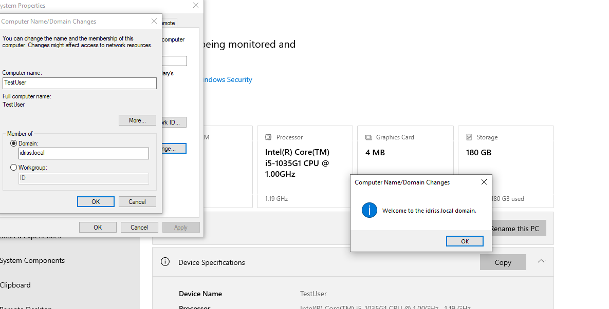

# Active Directory Lab – Trust Relationship Failure (Windows 11)

## Overview
This lab demonstrates how to reproduce and resolve the error:

"The trust relationship between this workstation and the primary domain failed."

Environment:
- Domain: idriss.local
- Domain Controller: Windows Server (AD DS)
- Client: Windows 11 (Domain Joined)

---

## Problem
User unable to log in using domain credentials.
Error displayed during login:
"The trust relationship between this workstation and the primary domain failed."

Screenshot:
Screenshots/01-trust-error.png

---

## Root Cause
Resetting the computer account in Active Directory invalidates the secure channel password stored in AD.
The workstation still stores the old machine account password locally.
This mismatch breaks the trust relationship between the workstation and the domain controller.

---

## Reproduction
1. Opened Active Directory Users and Computers.
2. Reset the computer account.
3. Restarted client machine.
4. Attempted domain login.
5. Error reproduced successfully.

---

## Resolution (Method Used)

1. Logged in using local administrator account.
2. Removed workstation from domain and joined temporary workgroup.
3. Rebooted system.
4. Rejoined workstation to domain using domain admin credentials.
5. Rebooted again.
6. Verified domain login successful.

Screenshots:
### Screenshot – Trust Relationship Error

### Screenshot – Join Workgroup

### Screenshot – Rejoin Domain

---

## Verification
- Domain login successful.
- Trust relationship restored.
- User able to access domain resources.

---

## ITSM Documentation
Incident documented in Jira using Kanban workflow:
To Do → In Progress → Resolved.

See:
jira/jira-ticket-kan-5.png

---

## Key Concepts Learned
- Machine account password
- Secure channel between workstation and DC
- Trust relationship failure
- Active Directory troubleshooting
- IT documentation and workflow management
