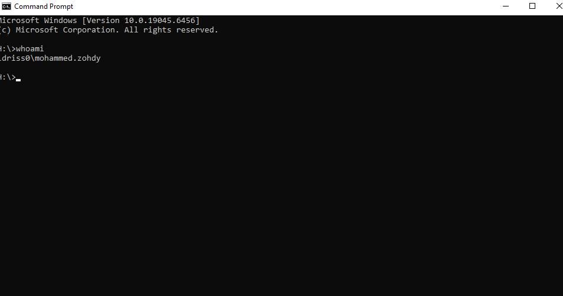
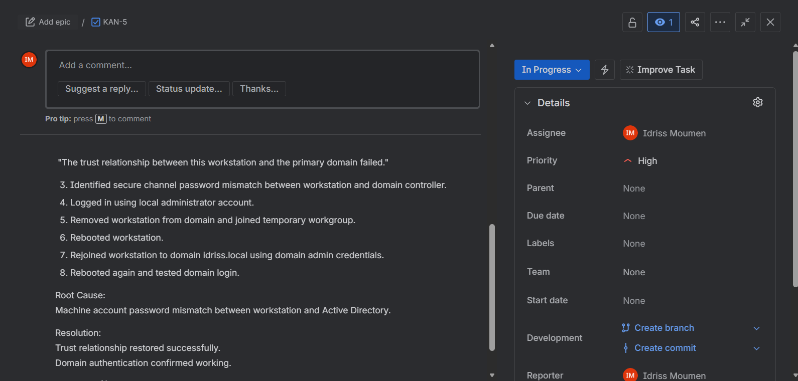

# Trust Relationship Failed – Windows 11 Domain Workstation

## Issue Description

User reported inability to log into domain account on a Windows 11 workstation.

**Error displayed:**

> "The trust relationship between this workstation and the primary domain failed."

Machine was previously joined to domain: **idriss.local**  
User unable to access network resources.

---

## Root Cause

A machine account secure channel password mismatch occurred between the workstation and Active Directory.

When the computer account password stored locally does not match the password stored in AD, the secure channel breaks and domain authentication fails.

---

## Resolution (Method Used)

1. Logged in using local administrator account.  
2. Removed workstation from domain and joined a temporary workgroup.  
3. Rebooted the workstation.  
4. Rejoined workstation to domain **idriss.local** using domain admin credentials.  
5. Rebooted again.  
6. Verified domain login successful.

---

## Screenshots

### 1) Trust Relationship Error


### 2) Join Temporary Workgroup


### 3) Rejoin Domain


### 4) Domain Login Verified

Command used:

```cmd
whoami
```

Output:

```cmd
idriss0\mohammed.zondy
```



---

## Jira Ticket (ITSM Documentation)

This incident was documented in Jira using a Kanban workflow:

To Do → In Progress → Resolved

### 5) Jira Ticket – Created (To Do Status)


### 6) Jira Ticket – In Progress


### 8) Jira Ticket – Resolved Status


