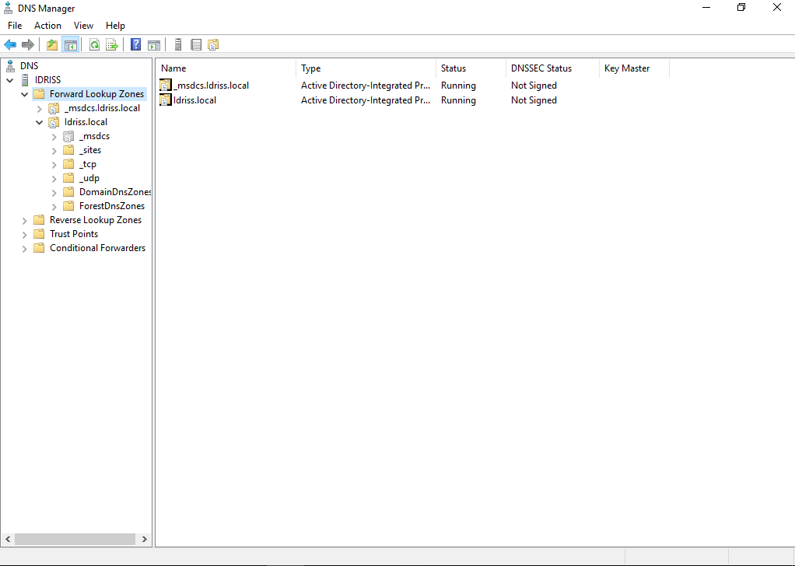
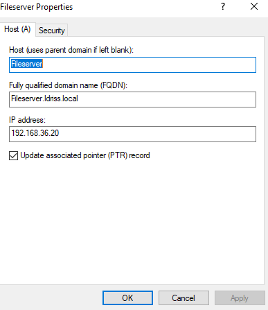
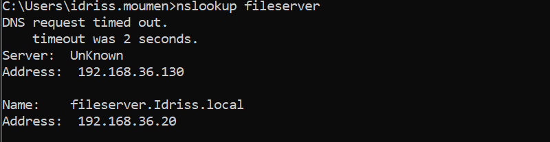
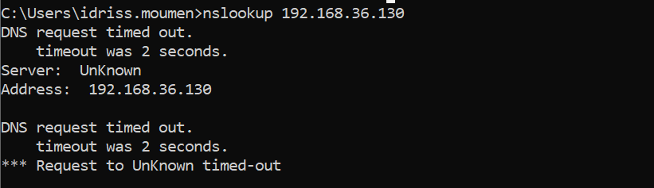
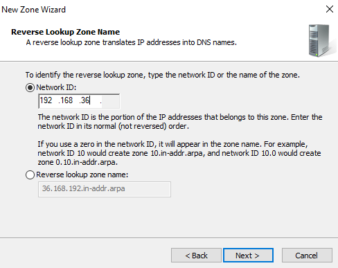
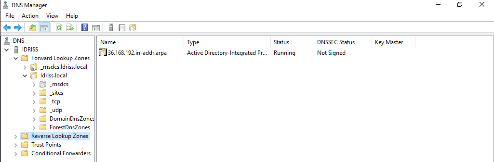
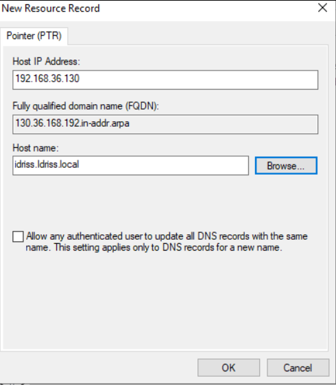
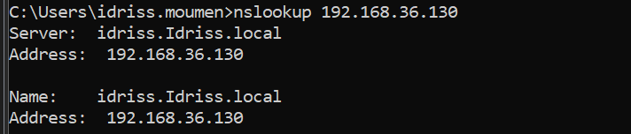

# 06 – DNS Server Configuration and Reverse Lookup Troubleshooting

## Objective

To configure DNS in a Windows Server domain environment and troubleshoot reverse DNS resolution issues related to missing PTR records.

---

## Lab Environment

- Windows Server (Domain Controller + DNS)
- Domain: idriss.local
- Server IP: 192.168.36.130
- Client joined to domain
- Network: 192.168.36.0/24

---

# Part 1 – Forward Lookup Verification

## Forward Lookup Zone Overview

---

## Created A Record

Created manual Host (A) record:

fileserver.idriss.local → 192.168.36.20

---

## Testing Forward Lookup

Command executed:

nslookup fileserver

Result:

- Hostname resolved successfully
- IP returned correctly
- However, DNS server displayed as "Unknown"

---

# Issue Identified

Running:

nslookup 192.168.36.130

Result:

- Request timed out
- Reverse resolution failed

---

# Root Cause

Reverse Lookup Zone was missing.

Although forward lookup (A record) was working correctly, there was no PTR record for:

192.168.36.130 (Domain Controller)

Because reverse DNS was not configured, nslookup displayed:

Server: Unknown

---

# Solution

## Step 1 – Create Reverse Lookup Zone

Created Reverse Lookup Zone using:

Network ID: 192.168.36

Zone created:

36.168.192.in-addr.arpa

---

## Step 2 – Create PTR Record for Domain Controller

Created PTR record:

192.168.36.130 → idriss.idriss.local

---

# Verification

After creating PTR record:

nslookup 192.168.36.130

Result:

- Reverse lookup successful
- DNS server name displayed correctly

---

# Key Concepts Learned

- A record = hostname → IP address
- PTR record = IP address → hostname
- Forward and reverse DNS are independent
- Reverse Lookup Zone is required for PTR resolution
- Missing PTR records can cause "Server: Unknown" in nslookup
- Proper DNS configuration improves troubleshooting clarity

---

# Conclusion

This lab demonstrated DNS configuration and troubleshooting in an Active Directory environment.

By identifying and resolving a missing reverse lookup configuration, full bidirectional DNS resolution was restored.

