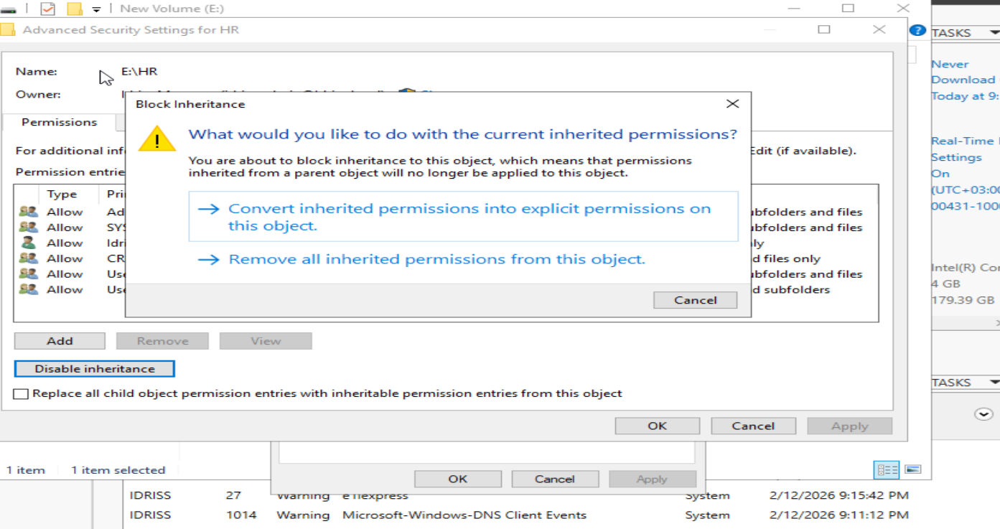

# File Server Labs (Windows Server 2019)

## 🎯 Objective

Configure a secure departmental file share using:

- RAID-5 storage volume
- Active Directory security groups
- Share permissions
- NTFS permissions
- Controlled inheritance

This simulates a real enterprise HR department file server.

---

## 🧱 Storage Foundation

The shared folder is hosted on a previously created RAID-5 dynamic volume to ensure:

- Redundancy (can tolerate one disk failure)
- Improved storage efficiency
- Enterprise-level fault tolerance

---

## 📁 Step 1 – Folder Creation

Created main folder:

E:\HR

Created subfolder:

E:\HR\Data

📸 Screenshot:

---

## 👥 Step 2 – Active Directory Security Group

Created Security Group:

HR

Added HR department users to the group.

This allows centralized permission management instead of assigning permissions per user.

---

## 🔐 Step 3 – Share Permissions Configuration

Removed default:

Everyone (Read)

Configured share permissions as follows:

| Group | Permission |
|--------|------------|
| Domain Admins | Full Control |
| HR Group | Read |

📸 Screenshot:

---

## 🛡 Step 4 – NTFS Permissions Configuration

### 1️⃣ Disabled Inheritance

Inheritance was disabled to fully control access permissions.

📸 Screenshot:

---

### 2️⃣ Custom NTFS Permissions

Configured HR group permissions:

✔ Allowed:
- Read
- List folder contents
- Create files
- Create folders

❌ Denied:
- Delete files
- Delete subfolders

This ensures:

- Users can create documents
- Users cannot delete company data

📸 Screenshot:

---

## 🖥 Step 5 – Client Access Verification

From a domain-joined client machine:

Accessed:

\\idriss\HR

Verified:

- Folder visibility
- File creation works
- Delete operation is restricted
- Permission model behaves as expected

📸 Screenshot:

---

## 🧠 Concepts Demonstrated

- RAID-backed storage for file services
- Security group-based permission design
- Share + NTFS layered security model
- Permission inheritance management
- Real-world department-based access control

---

## ✅ Result

Successfully deployed a secure HR file server using:

- Redundant storage (RAID-5)
- Centralized Active Directory group management
- Controlled access with granular NTFS permissions
- Client-side verification

  ---

# 📊 Disk Quota Configuration (Volume Level)

## 🎯 Objective

Prevent users from consuming excessive disk space on the file server.

Configured NTFS Disk Quotas on volume:

E:\

---

## ⚙ Configuration Details

Enabled:

✔ Enable quota management  
✔ Deny disk space to users exceeding quota limit  

Configured limits:

| Setting | Value |
|----------|--------|
| Quota Limit | 2 GB per user |
| Warning Level | 1 GB |

This means:

- User receives a warning when usage reaches 1 GB
- User cannot store additional data after reaching 2 GB

📸 Screenshot:

This lab demonstrates practical system administration and enterprise file server management skills.

