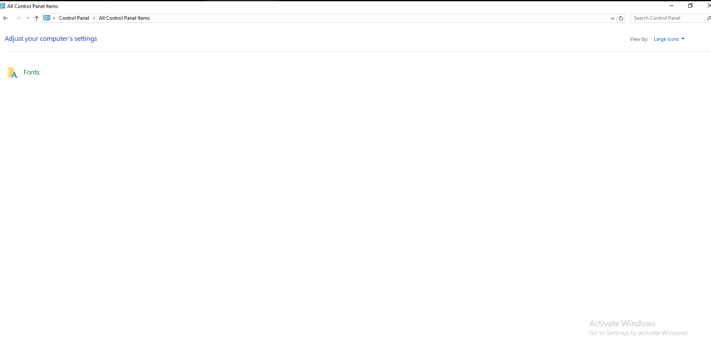
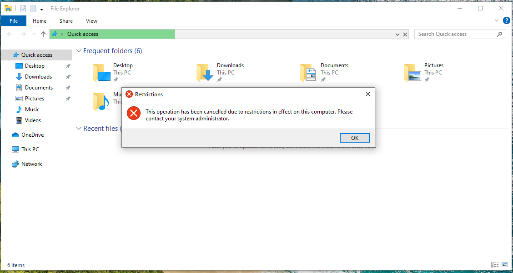

# Group Policy Labs (Windows Server 2019)

## Lab Overview
This lab demonstrates the use of Group Policy Objects (GPOs) to control user behavior and system access in a Windows Server 2019 Active Directory environment.

The policies were applied to the **HR Organizational Unit (OU)** to simulate real-world user restrictions commonly used in enterprise environments.

---

## Environment
- Platform: VMware Workstation
- Server OS: Windows Server 2019
- Client OS: Windows 10
- Domain: IDRISS.LOCAL

---

## GPO Design and Scope
- GPOs are linked to the **HR OU**
- User Configuration policies apply to HR users regardless of the computer used
- Computer Configuration policies apply to domain-joined machines
- Policy inheritance and scope were verified using Group Policy Management Console (GPMC)

---

## Implemented Group Policies

### 1. Disable Command Prompt (User Policy)
Command Prompt access was disabled to prevent users from executing command-line tools.

**Policy used:**
- User Configuration → Administrative Templates → System  
- Prevent access to the command prompt

**Result:**
Users receive a message indicating that Command Prompt has been disabled by the administrator.

---

### 2. Restrict Control Panel to Fonts Only (User Policy)
Control Panel access was restricted so users can only access the Fonts applet.

**Policy used:**
- User Configuration → Administrative Templates → Control Panel  
- Show only specified Control Panel items

**Result:**
All Control Panel items are hidden except Fonts.

---

### 3. Remove Folder Options View (User Policy)
Folder Options access was removed to prevent users from changing File Explorer settings such as hidden files and extensions.

**Policy used:**
- User Configuration → Administrative Templates → Windows Components → File Explorer  
- Do not allow Folder Options to be opened from the Options menu

**Result:**
Users are blocked from accessing Folder Options.

---

### 4. Disable External Storage (Computer Policy)
External storage devices were restricted to prevent data leakage via USB drives.

**Policy used:**
- Computer Configuration → Administrative Templates → System → Removable Storage Access  
- Deny read, write, and execute access

**Result:**
External drives are visible but inaccessible.

---

### 5. Deploy URL Shortcut via Group Policy Preferences
A URL shortcut was deployed to HR users’ desktops using Group Policy Preferences.

**Policy used:**
- User Configuration → Preferences → Windows Settings → Shortcuts

**Result:**
The shortcut appears automatically on user desktops.

---

## Verification and Results

### Group Policy Application
Group Policy application was verified on the client machine using `gpresult /r`.

**Notes:**
- Some commands are intentionally blocked due to applied policies
- This confirms correct policy enforcement rather than a failure

---

## Key Concepts Demonstrated
- GPO linking and scope (OU-based targeting)
- User vs Computer policies
- Policy inheritance and enforcement
- Real-world security restrictions
- Client-side verification and troubleshooting

---

## Conclusion
This lab demonstrates practical Group Policy administration skills used in IT support and system administration roles, including user restriction, device control, and centralized configuration management.
